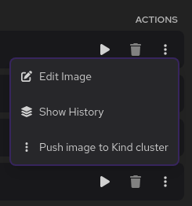

# Development Environment

This page outlines how to set up a development environment for this project. This document is meant to serve as a high-level mental model for how to set up a development environment. There are many ways to substitute certain components if a developer prefers one tool over another.

## Overview

The diagram below shows a high-level overview of the development environment.


[VSCode](https://code.visualstudio.com/) is used as the integrated development environment. VSCode is run in client-server mode: The desktop VSCode application is downloaded for the operating system of choice, and a project-specific [VSCode Dev Container](https://code.visualstudio.com/docs/devcontainers/containers) is used to run VSCode server as a dev container. The VSCode Dev Container is attached to the host network, so the development container can access ports exposed on `127.0.0.1`, for example.

[K9s](https://k9scli.io/) is used as a kubernetes dashboard, which provides a user interface for the developer to interact with the Kubernetes cluster.

[Podman](https://podman.io/) is a daemonless and rootless OCI-compliant runtime and container manager that can be used to build OCI images and run containers on your development machine.

[Kubernetes in Docker](https://kind.sigs.k8s.io/) (KinD) is a tool for running local kubernetes clusters entirely in OCI containers (i.e. OCI containers are used to run Kubernetes nodes). 

The sections below outline how to set up each component of this environment.

## VSCode Development Containers

**TLDR**: The `.devcontainer/devcontainer.json` file contains the dev container configuration for this project. If you install the [VSCode Dev Container extension](https://marketplace.visualstudio.com/items?itemName=ms-vscode-remote.remote-containers) and build/run the dev container, the dev container will be setup automatically. The section below highlights specific issues that you might encounter along with helpful resources to troubleshoot potential issues.

### Starting Dev Container as non-root user

I added the `"containerUser": "node"` key to start the dev container as the default non-root `node` user for the dev container. Since I am running my dev container on Ubuntu Linux, I also needed to add the following line to my `devcontainer.json` file:

```json
...,
	"runArgs": [
		"--userns=keep-id"
	],
...
```

This line of configuration is necessary because, on Linux, podman maps the user ID (UID) that launched the container process to the root user of the container. By default, this means that my current user ID (usually `1000` in most cases) maps to the UID `1` (i.e. root user of the container user namespace). You can run `podman unshare cat /proc/self/uid_map` on the host machine to see how host UIDs map to UIDs in the container process namespaces.

This caused problems as the files/folders in the repo are mounted to the container filesystem with `root` as the owner, so the `node` user didn't have permission to write to these files. Setting `--userns=keep-id` keeps the UID of `1000` in the container, so the repo files/folders that get mounted to the container filesystem are correctly owned by UID `1000` (i.e. `node` user), and it is possible to write to files in the container as the non-root user.

See [this stackoverflow answer](https://stackoverflow.com/a/70774211) for a more detailed explanation of how this works.

### Attach Development Container to Host Network

As per [this thread answer](https://community.home-assistant.io/t/developing-in-devcontainer-how-to-access-local-network-of-host/271935/2), add the following key in `devcontainer.json`.

```json
...,
	"runArgs": [
		"--network=host"
	],
...
```

## VSCode Development Tools

### VSCode Integrated Debugger

Debug configurations can be found in the `.vscode/launch.json` file in the project root. For information on how to use VSCode's integrated debugger, see the [VSCode Debugging documentation](https://code.visualstudio.com/docs/editor/debugging).

### Environment Variable Management with `direnv` 

In order to run or debug a given application in a dev container, it may be necessary load a specific set of environment variables to configure that application. [`direnv`](https://direnv.net/) is a tool that automatically loads environment variables into your shell when you `cd` into a folder.

You may need to run `direnv allow` in a directory upon making changes to its `.envrc` file.

## Podman

Instructions for installing the Podman runtime on all platforms can be found [at this link](https://podman.io/docs/installation). Additionally (and optionally), you can install [Podman Desktop](https://podman-desktop.io/), which provides a graphical tool to facilitate working with podman.

### Using Podman with KinD

It might be necessary to follow the steps in [Kind - Rootless](https://kind.sigs.k8s.io/docs/user/rootless/#creating-a-kind-cluster-with-rootless-podman). After following these instructions, I had to run `systemd-run --user --scope --property=Delegate=yes kind create cluster` to create my kind cluster. This [Linkedin Arcticle](https://www.linkedin.com/pulse/deploying-kubernetes-in-docker-kind-cluster-using-podman-tom-dean-1c) is also a good resource that reviews step-by-step setup of a KIND cluster using podman on Ubuntu Linux.

### Loading an image into the KinD Cluster

KinD doesn't spin up a local registry out of the box, so it's necessary to run `kind load docker-image <your image:tag>` to load a locally build container image into the KinD cluster.

If you're using Podman Desktop, there is a UI convenience for this by navigating to the **Images** tab, then for the image(s) you want to load into the KinD cluster, click **"Push image to Kind cluster"** (see screenshot below).



### Related Issues
- [KinD - Running with rootless podman doesn't work as documented](https://github.com/kubernetes-sigs/kind/issues/2872)
- [KinD - Podman creation fails](https://github.com/kubernetes-sigs/kind/issues/2537)
- [KinD - How I Wasted a Day Loading Local Docker Images](https://iximiuz.com/en/posts/kubernetes-kind-load-docker-image/)